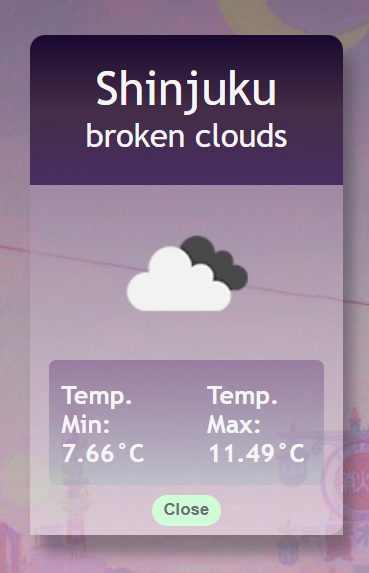

# :last_quarter_moon_with_face: Sailor Weather App :star:
This project it's a SPA that consumes https://openweathermap.org/api API to provide information of the weather in the city that you're looking for in real time.

It's all **React** whith **JavaScript**, **HTML** and **CSS**, and **SweetAlerts** when there's no coincidence between what you're searching and the API data. The responsive is still in progress :relaxed: :hammer_and_wrench:
  

| General          | Error Alert        |
| ---------------  | ------------------ |
|  | |

| NavBar Responsive | Card Detail |
| ----------------- | ----------- |
| | |

